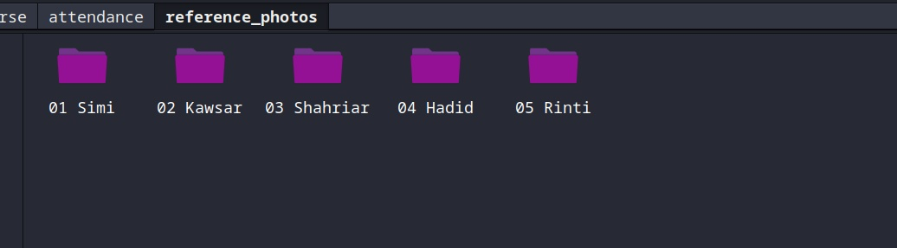

# Group Photo Attendance System

A computer vision based attendance system that identifies people from a single group photo and automatically generates an attendance record.

Instead of checking attendance one person at a time, the system can process a group photo containing around 40–50 people, detect the faces in the image, match them against an enrolled database, and generate a Present/Absent list.

> **Status:** Prototype  
> **Platform:** Linux and macOS  

---

## How It Works

The system has two main parts.

### 1. Enrollment

Each person is enrolled using one or more reference photos.

The system:

1. Detects the face in each reference photo.
2. Extracts a face-recognition embedding.
3. Stores the embedding in the reference database.
4. Supports multiple reference images for the same person.

Using multiple photos helps the system handle changes in face angle, lighting, and appearance.

### 2. Attendance

A group photo is provided to the attendance program.

The system:

1. Detects every face in the photo.
2. Generates an embedding for each detected face.
3. Compares each embedding with the enrolled database using cosine similarity.
4. Selects the best match for each detected face.
5. Marks the person as **Present** when the similarity score passes the configured threshold.
6. Marks people who are not matched as **Absent**.
7. Creates an annotated copy of the group photo for verification.
8. Saves the final attendance record as a CSV file.

---

## Features

- Attendance from a single group photo
- Designed for approximately 40–50 people in one frame
- Multiple reference photos per person
- Face detection using RetinaFace
- Face recognition using ArcFace embeddings
- Cosine similarity based matching
- Adjustable recognition threshold
- CPU-only inference
- Annotated output image for visual verification
- CSV attendance output
- Local database; no cloud service required

---

## Technologies

- **Python**
- **InsightFace (`buffalo_l`)**
  - RetinaFace - face detection
  - ArcFace - face recognition
- **ONNX Runtime** - model inference
- **OpenCV** - image processing and annotation
- **NumPy** - numerical operations

---

# Installation

## 1. Download the Project

Download the repository as a ZIP file from GitHub.

After downloading:

1. Extract the ZIP file.
2. Open a terminal.
3. Move into the extracted project directory.

For example:

```bash
cd Face-Recognition-Attendance-System-Prototype--main
```

Activate it:

```bash
source venv/bin/activate
```

After activation, your terminal should show something similar to:

```text
(venv)
```


### Install dependencies

```bash
pip install -r requirements.txt
```


---

# First Run

The first time InsightFace loads the required models, it may download the model files automatically.

This can take some time depending on your internet connection.

After the models have been downloaded, subsequent runs should use the locally available models.

> Make sure you have an active internet connection during the first model initialization if the required model files are not already available locally.

---

# Database

The project maintains a local database containing the enrolled people and their reference face information.

A simplified structure looks like this inside the `reference_photos` folder:





Each person can have multiple reference photos. During attendance, the detected face is compared against the available reference data for that person, and the best similarity score is used.

---

# Enrollment

Before taking attendance, every person who should be recognized needs to be enrolled.

### Step 1 - Add Reference Photos

Place the reference photos in the enrollment/input directory used by the project.

For better recognition, use photos with some variation in:

- Face angle
- Lighting
- Expression
- Distance from the camera

Try to use clear images where the face is visible.

### Step 2 - Run Enrollment

Run the enrollment script:

```bash
python3 enroll.py
```

Replace `enroll.py` with the actual enrollment script included in the project.

The system will detect the face, generate its embedding, and add the person to the database.

### Multiple Reference Photos

More than one reference photo can be used for the same person.

This is useful because a person may look different in the attendance photo due to:

- Different lighting
- Different camera angle
- Facial expression
- Distance from the camera

---

# Taking Attendance

Once the required people have been enrolled, a group photo can be used for attendance.

### Step 1 - Prepare the Group Photo

Place the group photo in the input location expected by the attendance program.

For best results:

- Use a high-resolution image.
- Make sure faces are visible.
- Avoid excessive blur.
- Avoid heavily obstructed faces.
- Try to keep the group reasonably well-lit.

### Step 2 - Run the Attendance Program

```bash
python3 attendance.py
```

The program will:

1. Load the enrolled database.
2. Read the group photo.
3. Detect all visible faces.
4. Generate embeddings.
5. Compare them with enrolled faces.
6. Apply the similarity threshold.
7. Generate the attendance CSV.
8. Create an annotated copy of the group photo.

---

# Output

The system produces two main outputs.

## 1. Attendance CSV

The CSV contains the attendance status for each enrolled person.

Example:

```text
Name,Status
Person 1,Present
Person 2,Present
Person 3,Absent
Person 4,Present
```

This file can be opened using Excel, LibreOffice Calc, Google Sheets, or another spreadsheet application.

## 2. Annotated Group Photo

The system also creates an annotated version of the original image.

Detected faces are marked with labels so that the recognition results can be visually checked.

This is useful for identifying incorrect matches instead of relying only on the CSV output.

---

# Recognition Threshold

The system uses a similarity threshold to decide whether a detected face should be considered a valid match.

The threshold controls the balance between:

- **False matches** — incorrectly identifying someone
- **Missed matches** — failing to recognize someone who is actually present

### Higher Threshold

A higher threshold makes the system more strict.

This can reduce false matches but may also increase missed matches.

### Lower Threshold

A lower threshold makes matching easier.

This may improve recognition in difficult images but can increase the chance of incorrect matches.

The threshold can be adjusted in the configuration/code according to the quality of the images and the required accuracy.

> Always verify the annotated image when using the system for real attendance records.

---

# Performance

The prototype is designed for group photos containing approximately 40–50 people.

Face detection on a full-resolution group image runs in under a second on the development hardware during testing. Recognition adds additional processing for each detected face, so the complete process generally falls within the low-single-digit-second range.

Actual performance depends on:

- CPU
- Image resolution
- Number of detected faces
- Number of reference embeddings
- Operating system
- Python/package versions

For an exact performance measurement on your machine:

```bash
time python3 attendance.py
```

---

# Troubleshooting

## `python3: command not found`

Python 3 is not available in your terminal.

Check your installation:

```bash
python3 --version
```

Install Python 3 for your operating system and try again.

---

## `pip install -r requirements.txt` fails

First make sure the virtual environment is active:

```bash
source venv/bin/activate
```

Then upgrade pip:

```bash
pip install --upgrade pip
```

Try installing the requirements again:

```bash
pip install -r requirements.txt
```

If the problem persists, check the error message carefully. Package compatibility can depend on the Python version and operating system.

---

## No Face Is Detected

Check the input image.

Possible causes include:

- Face is too small
- Poor lighting
- Heavy blur
- Face is partially covered
- Extreme face angle
- Low-resolution image

Using a higher-resolution group photo and clearer reference images can improve results.

---

## Incorrect Person Is Detected

Try the following:

1. Use additional reference photos for the person.
2. Use clearer reference photos.
3. Increase the similarity threshold.
4. Check the annotated output image.
5. Make sure the reference database does not contain incorrect or duplicate data.

---

## A Person Is Marked Absent Even Though They Are in the Photo

Possible causes include:

- The face is too small in the group image.
- The face is partially obstructed.
- Lighting is significantly different from the reference photos.
- The similarity threshold is too high.
- The reference photos are not representative enough.

Adding reference photos from different angles and lighting conditions may help.

---

# Recommended Photo Conditions

For better results, use:

- High-resolution group photos
- Good and reasonably even lighting
- Clear, unobstructed faces
- Minimal motion blur
- Reference photos with different angles and lighting

The system is designed to work with group photos, but recognition becomes more difficult as individual faces become smaller within the image.

---

# Limitations

This is a prototype rather than a production attendance system.

Recognition accuracy can be affected by:

- Very small faces
- Occlusion
- Poor image quality
- Extreme lighting
- Extreme face angles
- Similar-looking individuals

For this reason, the annotated output should be checked before treating the generated attendance record as final.

The system is also intended to run locally and does not provide cloud-based synchronization or centralized attendance management.

---

# Privacy

This project processes face images and biometric representations locally.

Only use the system with appropriate permission from the people whose images and biometric data are being processed.

Do not upload personal face data to public repositories.

If you are sharing this project publicly, make sure that any sample images, databases, or reference photos included in the repository do not contain real people's personal data unless you have permission to publish them.

---

## About

This project was built as a prototype to explore the practical application of face detection and face recognition for automated group attendance.

The main focus was handling multiple faces in a single image rather than the single-face scenarios commonly used in basic face-recognition examples.
